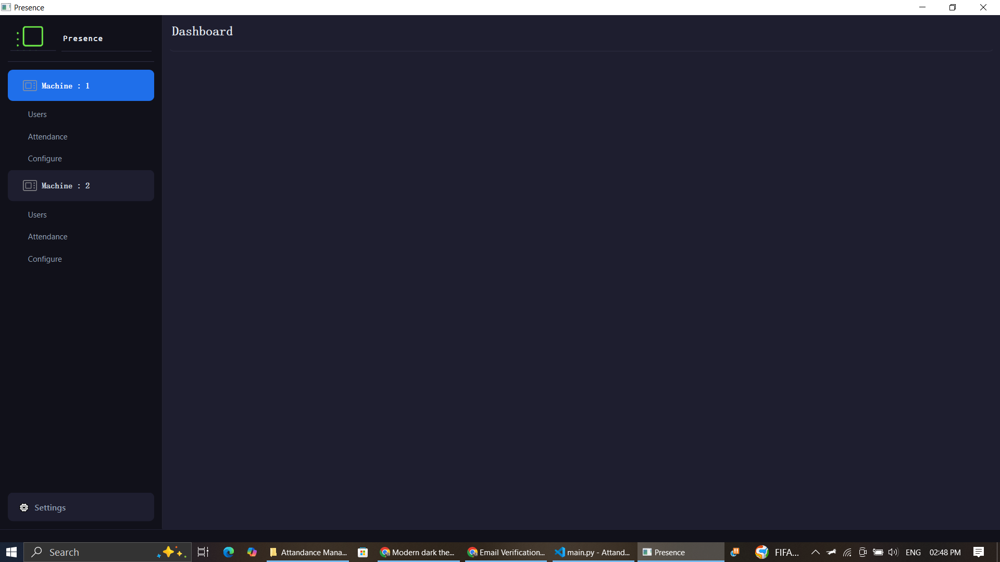
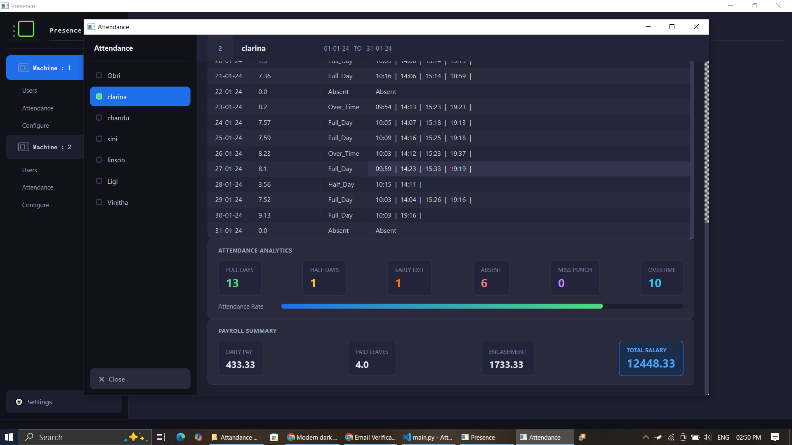
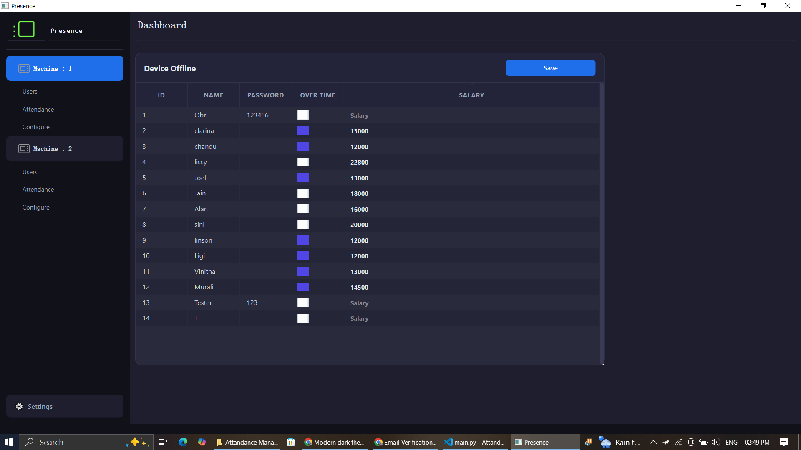

# Presence — Attendance & Payroll Management System

This is a desktop app I built for a real client — a local laundry business 
that needed a way to track employee attendance and calculate monthly payroll 
using their existing ZKTeco biometric punch machines. 
Most of the company specific attendance policy variables can be configured from the
settings page.

Built with Python and PySide6. Took about 3 months to complete.

---

## What it does

- Connects to ZKTeco biometric devices over TCP and pulls attendance records
- Lets you select a date range and generates a per-employee attendance report
- Calculates payroll — full days, half days, overtime, early exits, absences
- Supports 2 devices simultaneously (they have machines at 2 locations)
- Exports reports for record keeping

---

## Tech used

- Python 3.11
- PySide6 for the UI
- SQLite for local storage
- pyzk to talk to the ZKTeco devices
- pandas for attendance data processing

---

## Running it locally

You'll need Python 3.11+ and a ZKTeco device on the same network.

Ideally, disable DHCP on the ZKTeco device and use port number 4370.
Setup the device with the software by clicking the configure button on the software.

```bash
pip install -r requirements.txt
python main.py
```
---

## Configuration on software

Once the ZKTeco device is connected, click on `Configuration` button and add Device IP, Port Number and Name.

`Save` button only saves a new device if the new device is online.
You can use the `Test connection` button in the configuration page to 
verify that the device is connected and the software can access the device.


---

## Project Structure

```
Attendance Management System/
│   main.py                       # entry point and app callbacks
│   resources_rc.py               # compiled Qt resources
│   resources.qrc                 # Qt resource definitions
│   icon.ico                      # application icon
│
├───database/
│       sqlite_db.py              # database connection helper
│
├───device/
│       Zk_device.py              # ZKTeco biometric device handler
│
├───models/
│       Attendance.py             # attendance data model
│       Users.py                  # user data model
│
├───services/
│       services.py               # core business logic
│       analytics.py              # attendance analytics and payroll
│
├───ui/
│       main.ui                   # main window layout
│       attendance_page.py        # attendance page logic
│       attendance.ui             # attendance page layout
│       configuration.py          # device configuration logic
│       configuration.ui          # device configuration layout
│       date_selection.py         # date range picker logic
│       date_selection.ui         # date range picker layout
│       loading_page.ui           # splash/loading screen
│       settings.py               # app settings logic
│       settings.ui               # app settings layout
│       users_page.py             # user management logic
│       users.ui                  # user management layout
│
└───utils/
    └───helper/
            ClickFilter.py        # Qt event filter for label clicks
            PyInstaller_helper.py # path resolution for packaged exe
```
---

## Screenshots

| Main Window | Attendance Report | Users |
|---|---|---|
|  |  |  |

---

## Notes

This was built as a real client project so some configuration 
(device IP, port) is stored in the local database and set up 
through the app's configuration page.

The app ships as a standalone `.exe` built with PyInstaller — 
the client doesn't need Python installed.

The app is tested on ZKTeco based `ESSL K30` machines.

---

## Author
**Vaxson Varghese**  | Software Developer  
[GitHub](https://github.com/vaxson)

